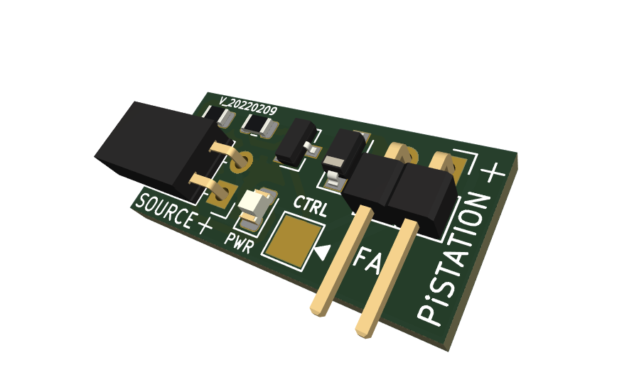

NESPi Fan Control Board
===============================
This is a temperature control board for the RetroFlag NESPi Case and the YIKESHU Black NES Case, this PCB add the ability to cool down your system during gameplay.

License
-------
<div align="center"><a rel="license" href="https://creativecommons.org/licenses/by-nc-sa/4.0/"></a><br /></div>

This project is licensed under the Attribution-NonCommercial-ShareAlike CC BY-NC-SA 4.0 license. The full legal text of the license may be found in the LICENSE.txt file in this repository. For more information about this license, please visit 
the Creative Commons Foundation (https://creativecommons.org/licenses/by-nc-sa/4.0/).

Features
--------

* Fully compatible script with Raspbian, RetroPie, RecalBox and Batocera

* Small footprint (NESPi 25.3mm x 10.7mm - SUPERPi-U 23.2mm x 10.6mm - NESPi-4 24.2mm x 11.8mm - RASPI-FAN 25.3mm x 10.7mm)

* Easy Temperature Control

* 1 wire fan control

* Compatible with 5V Fans

* 2.0mm 2-Pin Right-Angle JST Socket Fan Connector

* 2x 1.25mm 2-Pin Right-Angle JST Socket Fan Connector (NESPi-4 only)

* 2.54mm 2-Pin Right-Angle Through Hole Fan Connector (RASPI-FAN only)

* Minimal hardware modification

* One-line script installation

* Compatible with RetroFlag NESPi-4, SNESPi Case U/J, MEGAPi Case, NESPi Case/NESPi Case +, and the YIKESHU Black NES Case. For none RetroFlag Raspberry Pi Cases use RASPI-FAN Control Board.

* You can buy the latest version of this board fully assembled from [http://mini-mods.com](https://mini-mods.com/product-category/fan-control-kits/)

----------
* NESPi Fan Control Compatible with: MEGAPi Case, NESPi Case/NESPi Case + and the YIKESHU Black NES Case.


* SUPERPi-U Fan Control Compatible with: SNESPi Case U and SNESPi Case J.


* NESPi-4 Fan Control Compatible with: NESPi-4 Case.


* PiSTATION Fan Control Compatible with: PiStation Case.


* RASPI-FAN Control Compatible with: none RetroFlag cases for all Raspberry Pi models.


* RASPI-FAN Control with Lock Header Compatible with: none RetroFlag cases for all Raspberry Pi models.

----------

Prerequisites
---------------------

1. A Raspberry Pi runing: Raspbian, RetroPie, RecalBox or Batocera

      To install Retropie you may download the image for [Raspberry Pi](https://github.com/RetroPie/RetroPie-Setup/releases/download/4.2/retropie-4.2-rpi2_rpi3.img.gz "RetroPie for version RPi 2/3/4") 2/3/4 and follow the installation instruction at the [retropie website](https://retropie.org.uk/docs/First-Installation/#installation "RetroPie installation instructions").
	  
      To install RecalBox download the latest image for Raspberry Pi 2/3/4 and follow the installation instruction at the [recalbox website](https://download.recalbox.com "RecalBox installation instructions").
	  
      To install Batocera download the latest image for Raspberry Pi 2/3/4 and follow the installation instruction at the [batocera website](https://batocera.org/download "Batocera installation instructions").

2. Internet connection

      Internet access via Ethernet or to set up your internet via WiFi, you can follow the instructions [here](https://retropie.org.uk/docs/Wifi/ "RetroPie WiFi Setup").

3. Keyboard and screen, or any computer/laptop (via SSH)

      To access your Pi via SSH, you can also follow this instructions [here](https://retropie.org.uk/docs/SSH/ "Raspberry Pi SSH Setup").

4. Basic soldering skills

      This PCB need to be solder directly into the built-in fan connector.
	  
Hardware Installation
---------------------
It's very important to follow the right pin configuration to prevent damage to your Pi.

  * `FAN_CT Pin` - Connect to GPIO 17 (RPI pin 11)
  * `SOURCE Pin` - Connect to the built-in fan connector (follow polarity markings)
  


Software Installation
---------------------

**NOTE**: This assumes that you have already connected the jumper wires to the correct PINS and ports;
If you haven't, see the [Hardware Installation](#hardware-installation) section.

This instructions are a *step-by-step guide* to install necessary software for your **NESPi Fan Control Board**.
You can setup this via SSH or using the command line interface in your Raspberry Pi.

----------
For Raspbian and RetroPie:

1. Make sure internet is connected.
2. Make sure keyboard is connected (if working directly on the Raspberry Pi).
3. Press F4 to open the terminal.
4. On the terminal, type the one-line command below (Case Sensitive):

```bash
wget -O - "https://github.com/mafe72/NESPi-Fan-Control-Board/raw/master/install.sh" | sudo bash
```

----------
For RecalBox:

1. Make sure internet is connected.
2. Make sure keyboard is connected (if working directly on the Raspberry Pi).
3. Press F4 first, then press ALT-F2 to access the terminal.
4. User: root Password: recalboxroot
5. On the terminal, type the one-line command below (Case Sensitive):

```bash
wget -O - "https://github.com/mafe72/NESPi-Fan-Control-Board/raw/master/recalbox_install.sh" | bash
```

----------
For Batocera:
1. Make sure internet is connected.
2. Make sure keyboard is connected (if working directly on the Raspberry Pi).
3. Access the terminal. Follow the instructions [here](https://wiki.batocera.org/access_the_batocera_via_ssh "Access Batocera Linux via ssh").
4. User: root Password: linux
5. On the terminal, type the one-line command below (Case Sensitive):

```bash
wget -O - "https://github.com/mafe72/NESPi-Fan-Control-Board/raw/master/batocera_install.sh" | bash
```


The script will automatically install pertinent files and configure your Raspberry Pi to enable **NESPi Fan Control Board.**
Installation will automatically reboot once all processes is completed.

After rebooting, your **NESPi Fan Control Board** is now fully functional.

----------

Using the RASPI-Fan Board
-----------
To use the RASPI-Fan Board is necessary to edit the default ```fanGPIO``` signal on the fan control script ```fan_ctrl.py``` from GPIO17 to GPIO4.


```bash
#----------------------------------------------------
#Edit this value to change the default GPIO Fan Signal

#GPIO 17 default Fan ON/OFF Signal
fanGPIO=4

#NOTE:Reboot Raspberry Pi after changing these values
#----------------------------------------------------
```

Script location for Raspbian, RetroPie and RecalBox is:

```bash
/opt/MiniMods/fan_ctrl.py
```

Script location for Batocera is:
```bash
/userdata/MiniMods/fan_ctrl.py
```

----------

Software Uninstall
---------------------

This instructions are a *step-by-step guide* to uninstall necessary software for your **NESPi Fan Control Board**.
You can setup this via SSH or using the command line interface in your Raspberry Pi.

----------
For RetroPie:

1. Make sure internet is connected.
2. Make sure keyboard is connected (if working directly on the Raspberry Pi).
3. Press F4 to open the terminal.
4. On the terminal, type the one-line command below (Case Sensitive):

```bash
wget -O - "https://github.com/mafe72/NESPi-Fan-Control-Board/raw/master/uninstall.sh" | sudo bash
```

----------
For RecalBox:

1. Make sure internet is connected.
2. Make sure keyboard is connected (if working directly on the Raspberry Pi).
3. Press F4 first, then press ALT-F2 to access the terminal.
4. User: root Password: recalboxroot
5. On the terminal, type the one-line command below(Case sensitive):

```bash
wget -O - "https://github.com/mafe72/NESPi-Fan-Control-Board/raw/master/recalbox_uninstall.sh" | bash
```

----------
For Batocera:
1. Make sure internet is connected.
2. Make sure keyboard is connected (if working directly on the Raspberry Pi).
3. Access the terminal. Follow the instructions [here](https://wiki.batocera.org/access_the_batocera_via_ssh "Access Batocera Linux via ssh").
4. User: root Password: linux
5. On the terminal, type the one-line command below (Case Sensitive):

```bash
wget -O - "https://github.com/mafe72/NESPi-Fan-Control-Board/raw/master/batocera_uninstall.sh" | bash
```

The script will automatically uninstall all configuration files from your Raspberry Pi to disable the **NESPi Fan Control Board.**
The uninstall script will automatically reboot once all processes are completed.

After rebooting, your **NESPi Fan Control Board** will be fully deactivated.

----------
	
Basic Usage
-----------

* FAN ON
			
		Fan will turn ON when temperature exceeded 55C
		
* FAN OFF
		
		Fan will turn OFF when temperature under 40C

----------
	
Adjust Temperature Settings
-----------
To adjust the temperature settings, edit the ```fan_ctrl.py``` script and adjust the following parameters to your needs:

```bash
#----------------------------------------------------
#Edit these values to change the fan control settings
#Adjust MIN and MAX TEMP as needed

#Turn off fan when under
minTEMP=40

#Turn on fan when exceeded
maxTEMP=55

#NOTE:Reboot Raspberry Pi after changing these values
#----------------------------------------------------
```

Script location for Raspbian, RetroPie and RecalBox is:

```bash
/opt/MiniMods/fan_ctrl.py
```

Script location for Batocera is:
```bash
/userdata/MiniMods/fan_ctrl.py
```

----------
	
Use Alternative GPIO Fan ON/OFF Signal
-----------
To use an alternative GPIO signal, edit the ```fan_ctrl.py``` script and adjust the following parameters to your needs:

```bash
#----------------------------------------------------
#Edit this value to change the default GPIO Fan Signal

#GPIO 17 default Fan ON/OFF Signal
fanGPIO=17

#NOTE:Reboot Raspberry Pi after changing these values
#----------------------------------------------------
```

Script location for Raspbian, RetroPie and RecalBox is:

```bash
/opt/MiniMods/fan_ctrl.py
```

Script location for Batocera is:
```bash
/userdata/MiniMods/fan_ctrl.py
```

----------

Hardware change log
-----------
R_20210729

* Add RASPI-FAN Control with Lock Header, Compatible with none RetroFlag cases for all Raspberry Pi models.

R_20210726

* Add RASPI-FAN Control, Compatible with none RetroFlag cases for all Raspberry Pi models.

V_20200917

* Add compatibility with NESPi-4 Case.

V_03302018

* ACT_LED will only light-up when the fan is active.

V_02012018

* Initial release.